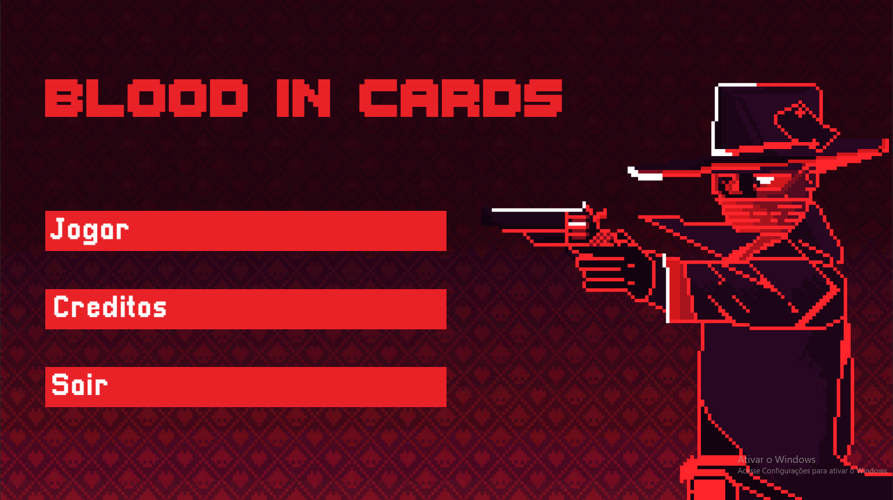
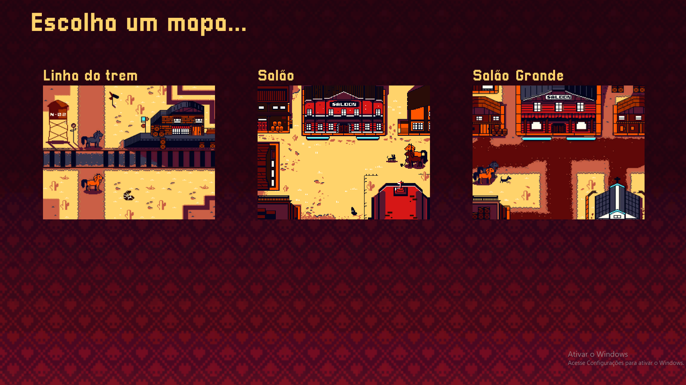
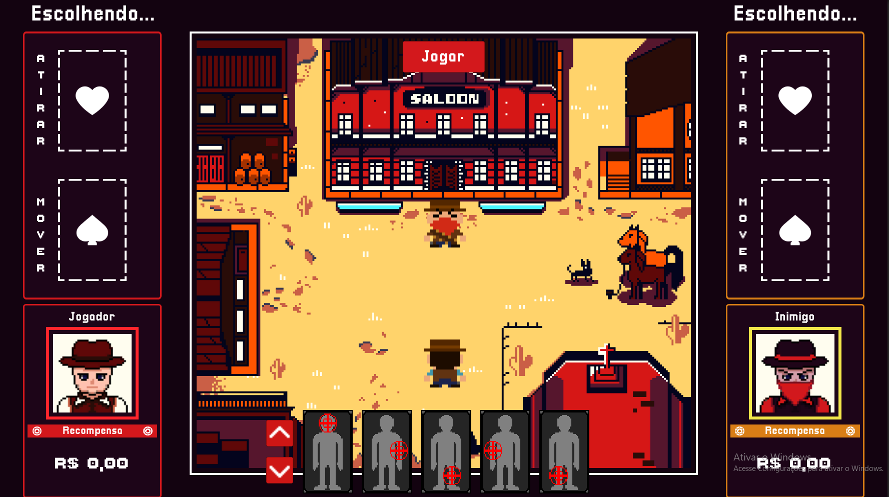

# Blood In The Cards
Está chegando a hora de saber quem é o mais mortal do velho-oeste, use suas cartas na manga para vencer.

## Mecânica
No jogo existem 2 tipos de cartas e cada jogador possui o mesmo número disponível sendo ao todo 10  cartas, 5 de movimento e 5 de tiro essas cartas se classificam em: 

### Movimentação: 
- Pular(Ambas as pernas e torso são invulneráveis)
- Abaixar(cabeça e torso são invulneráveis)
- Andar para a esquerda(Braço direito e perna direita são invulneráveis)
- Andar para a direita(Braço esquerdo e perna esquerda são invulneráveis) -Parado(Seus membros aguentam o dano menos na cabeça e no torso).

### Atirar: 
- Atirar na cabeça.
- Atirar no braço esquerdo.
- Atirar no braço direito. 
- Atirar na perna esquerda.
- Atirar na perna direita.

